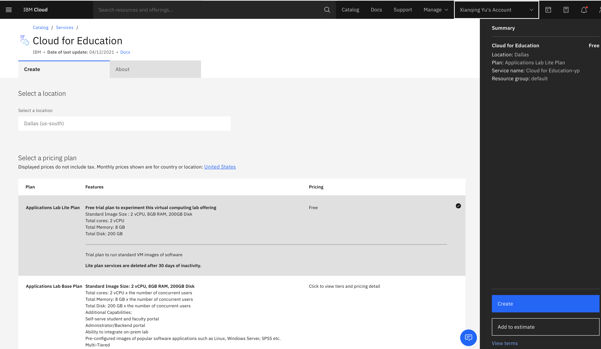

---

copyright:
  years: 2021
lastupdated: "2021-03-18"

keywords: login, authentication

subcollection: cloud-for-education

---

{:shortdesc: .shortdesc}
{:external: target="_blank" .external}
{:codeblock: .codeblock}
{:pre: .pre}
{:screen: .screen}
{:tip: .tip}
{:important: .important}
{:note: .note}
{:term: .term}

# Accessing Applications Lab Lite Plan environment
{: #access-lite-plan-env}

1. You can launch the Applications Lab URL through Resource List after you create the lite plan
   instance.

2. Launch the Applications Lab instance from the detail page. Or you can launch the Applications Lab
   URL directly at https://app.education.cloud.ibm.com/

   

3. Choose ***IBMid Login*** and follow the instruction to login.

  
