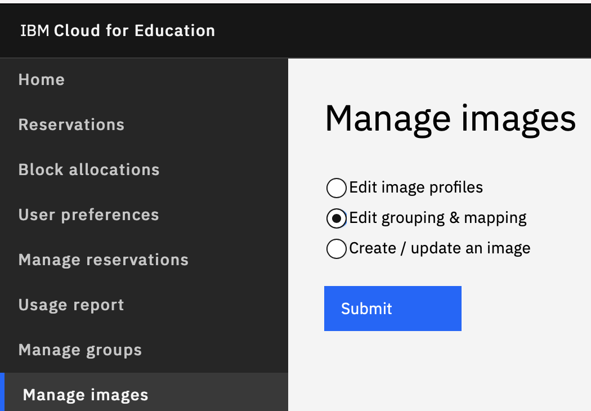
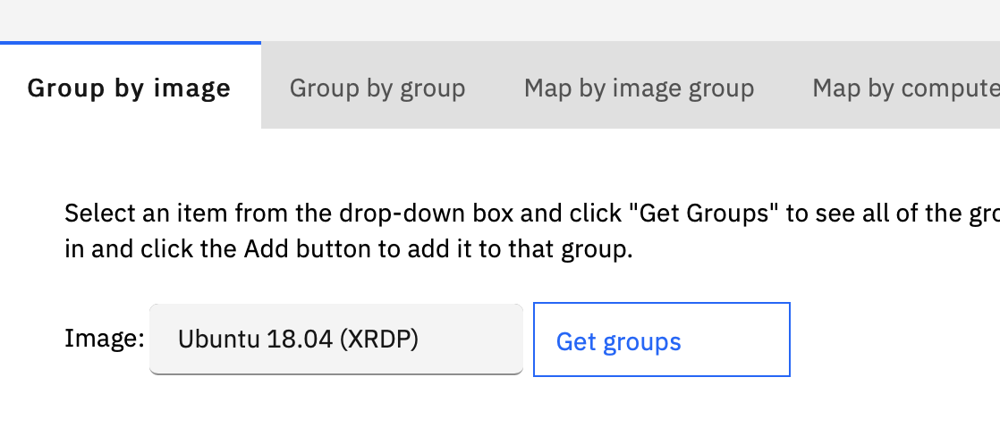

---

copyright:
  years: 2021
lastupdated: "2021-04-06"

keywords: login, authentication

subcollection: cloud-for-education

---

{:shortdesc: .shortdesc}
{:external: target="_blank" .external}
{:codeblock: .codeblock}
{:pre: .pre}
{:screen: .screen}
{:tip: .tip}
{:important: .important}
{:note: .note}
{:term: .term}

# Adding New Image into Image Pool
{: #addto-image-pool}

1.	When created a new image (not updated image), if this image require virtual machine with less 4 CPU cores and 8 GB memory size, you can add this image to your institute image pool. This image will be available to all your institute users.

1.	Select **Edit Grouping & Mapping** from **Manage Images**.

1.  Choose **Group by Image**, then choose **Your-Image** for Image, click  **Get Groups**.
    Available groups should be shown on **Groups Your-Image is not in**. Select
    **Your institution name-Images**, then click **Add** button. Then you should be
    able to reserve your new image.
  
