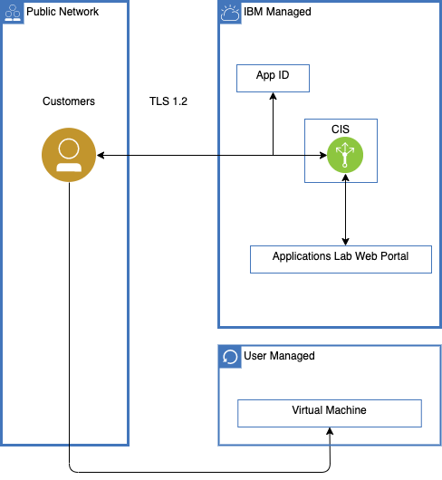

---

copyright:
  years:  2021
lastupdated: "2021-03-31"

keywords: IAM access for IBM Cloud for Education, permissions for IBM Cloud for Education, identity and access management for IBM Cloud for Education, roles for IBM Cloud for Education, actions for IBM Cloud for Education, assigning access for IBM Cloud for Education

subcollection: _your-subcollection_

---

{:external: target="_blank" .external}
{:shortdesc: .shortdesc}
{:table: .aria-labeledby="caption"}
{:tip: .tip}
{:important: .important}
{:note: .note}

# Learning about IBM Cloud for Education Applications Lab architecture and workload isolation
{: #compute-isolation}
<!-- The title of your H1 should be Learning about _servicename_ architecture and workload isolation, where _service-name_ is the non-trademarked short version conref, but the first occurrence in your topic is the trademarked version. Include your service name as a search keyword at the top of your Markdown file. See the example keywords above. -->

IBM Cloud for Education Applications Lab architecture describe its components and how customers' workloads are isolated. 
{: shortdesc}

## IBM Cloud for Education Applications Lab Architecture
{: #architecture}

The following image shows the components can be managed by you. All virtual machines (VM) are accessed by VM's public IP address. You can choose one of desired secure protocol to access, such as SSH and RDP.

## IBM Cloud for Education Applications Lab Workload Isolation
{: #workload-isolation}

Your workloads are running inside your own VM. Strong isolation among VMs are enfored by hypervisor. VM can be only accessed by VM's public IP address, and your username and random password is used to perform authentication.
