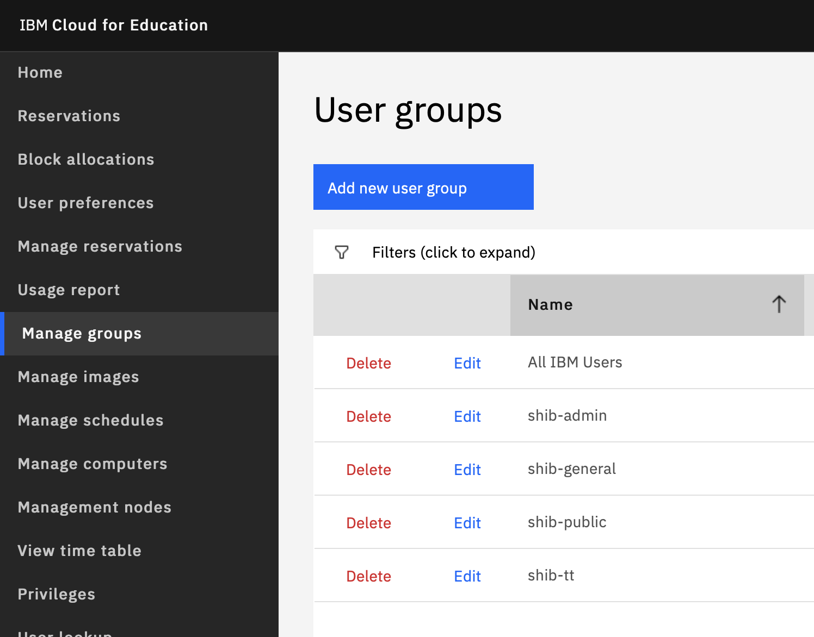
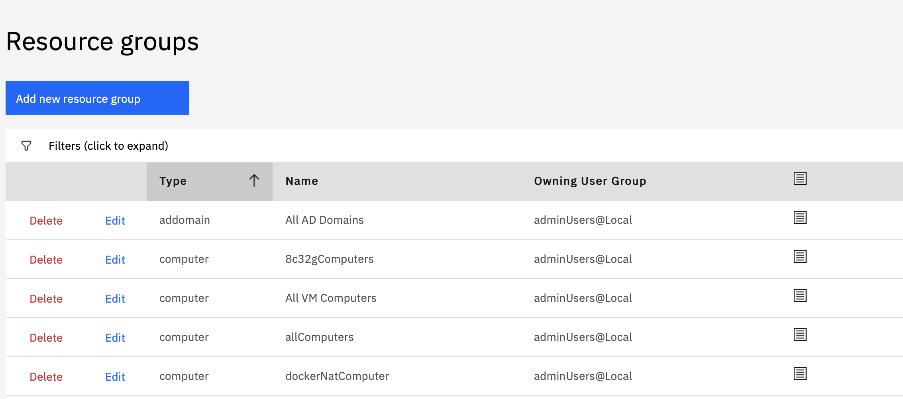
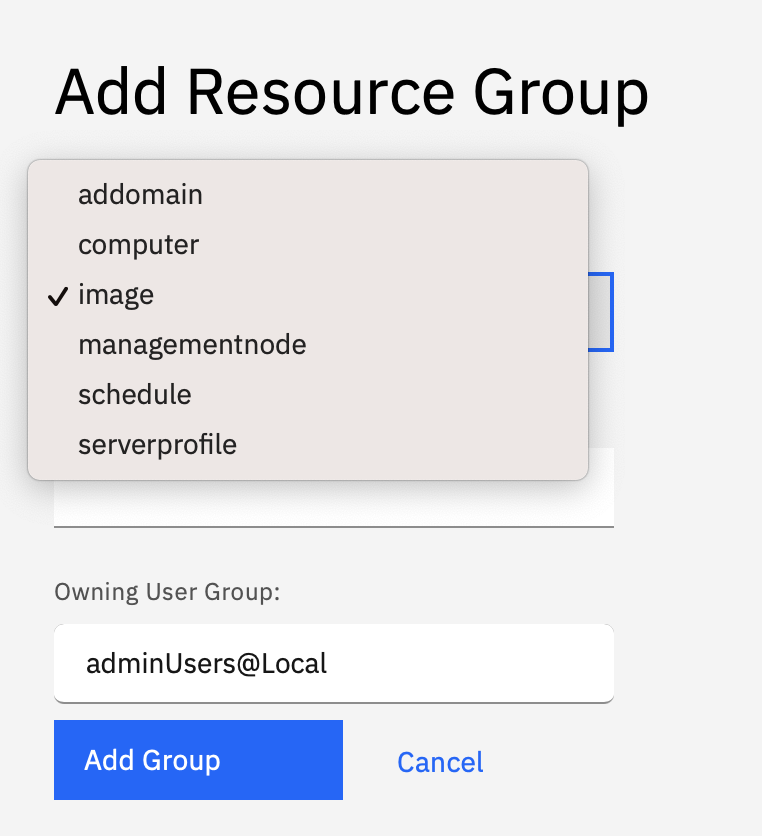

---

copyright:
  years: 2021
lastupdated: "2021-04-06"

keywords: login, authentication

subcollection: cloud-for-education

---

{:shortdesc: .shortdesc}
{:external: target="_blank" .external}
{:codeblock: .codeblock}
{:pre: .pre}
{:screen: .screen}
{:tip: .tip}
{:important: .important}
{:note: .note}
{:term: .term}

# Granting Customized User Group to Access a Customized Image Group
{: #grant-access-customized-image}

This method can define a group users to access a group of images. It can be useful when you have a
special image or images, and only want them to be used by a restricted group of users (e.g. a class).

1. Manually create an user group or create user group by institution federated system.

  If you want to manually create an user group:

  - Create an user group by clicking on **Manage Groups**, then click **Add new User Group**.

  

  -	Choose the user group name and its privilege, then click **Add Group**.

  -	Click ***Edit*** to add any user to that group by users’ school ID.

  If you want to create user group by institution federated system, contact your IT department, and
  add the user group in its system, the user group will be automatically created when the first user
  login.

1.	Add Image Group by clicking  **Add New Resource Group**.

1.	Choose **Image** as **Type**, and input the name you like.

1.  Use the same way in [Adding Image to Image
    Pool](/docs/cloud-for-education?topic=cloud-for-education-creating-updating-images) to add
    target images to your new image group. 

1.	Send your user group name and image group name to **cldedu@us.ibm.com**. We will assign proper resource mapping.

