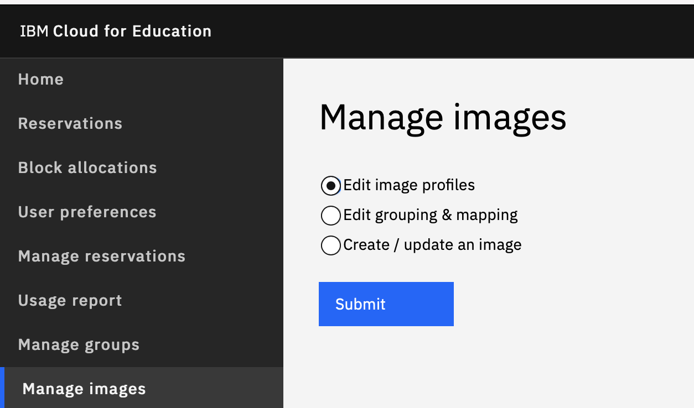
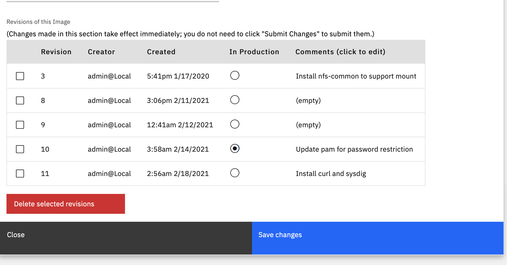
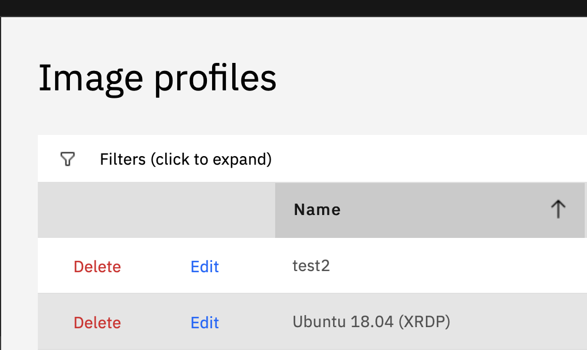

---

copyright:
  years: 2021
lastupdated: "2021-04-06"

keywords: Image, configure, delete

subcollection: cloud-for-education

---

{:shortdesc: .shortdesc}
{:external: target="_blank" .external}
{:codeblock: .codeblock}
{:pre: .pre}
{:screen: .screen}
{:tip: .tip}
{:important: .important}
{:note: .note}
{:term: .term}

# Configuring Image Setting and Deleting Image
{: #image-config-delete}

1. Choose **Manage Images** and **Manage Image Profiles**, you will see the list of image belong to you (you are the image owner/admin). 

1. Click **Edit** button, you can edit the configuration of the image. It defines the number of CPU cores, size of the memory. We recommend to use 2000 as CPU speed.

   - The name will be displayed on the drop-down menu when users select **Image**. Please use names that are easy to understand for users, such as software name and version, class name and code etc.

   - The owner is the main manager of this image. You can transfer the owner to someone by replacing the name here. You have to know their email, for example, for user xxx@domain.edu.ec, add xxx@domain here.

   - **Description** and **Usage Notes** will be displayed on the web page when users use it. You can add instructions on how to use the images.

   - **Maximum Concurrent usage** can limit the number of concurrent users can use this image. It is usually used for the images which has restriction on software license.

   - **Available for checkout** should be selected if the image is ready for students. Otherwise, students cannot see this image.

   - **Revision** indicates the different versions this image has. You can have comments for each
     version, and select one version as production version, and delete any unwanted version.
     Production version will be automatically chosen when students reserve this image.
     You can delete any revisions 

     

  - Each image has **delete** button for deleting entire image.

  

