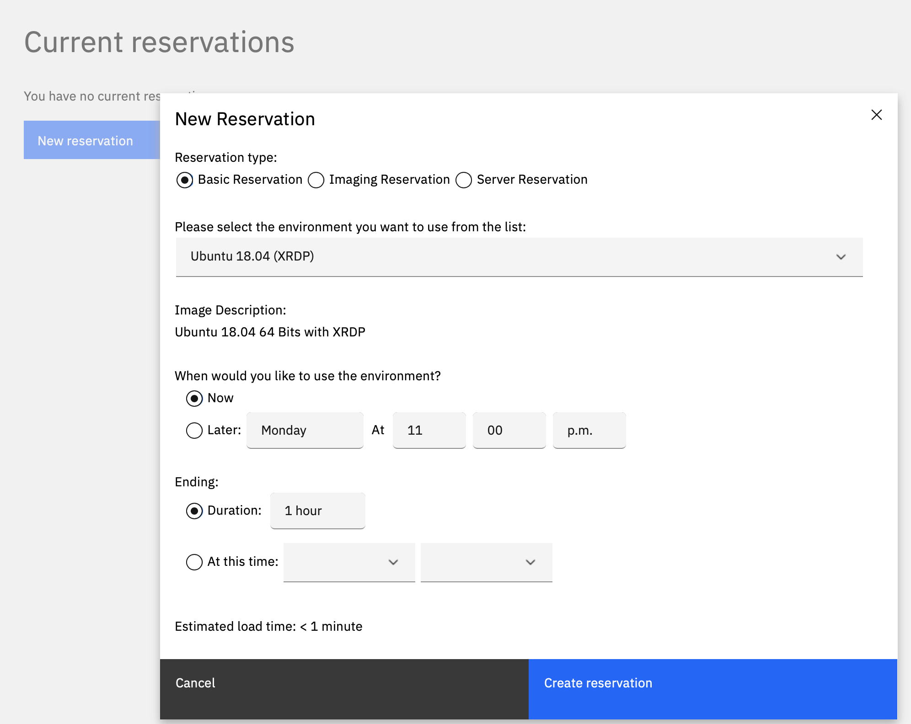
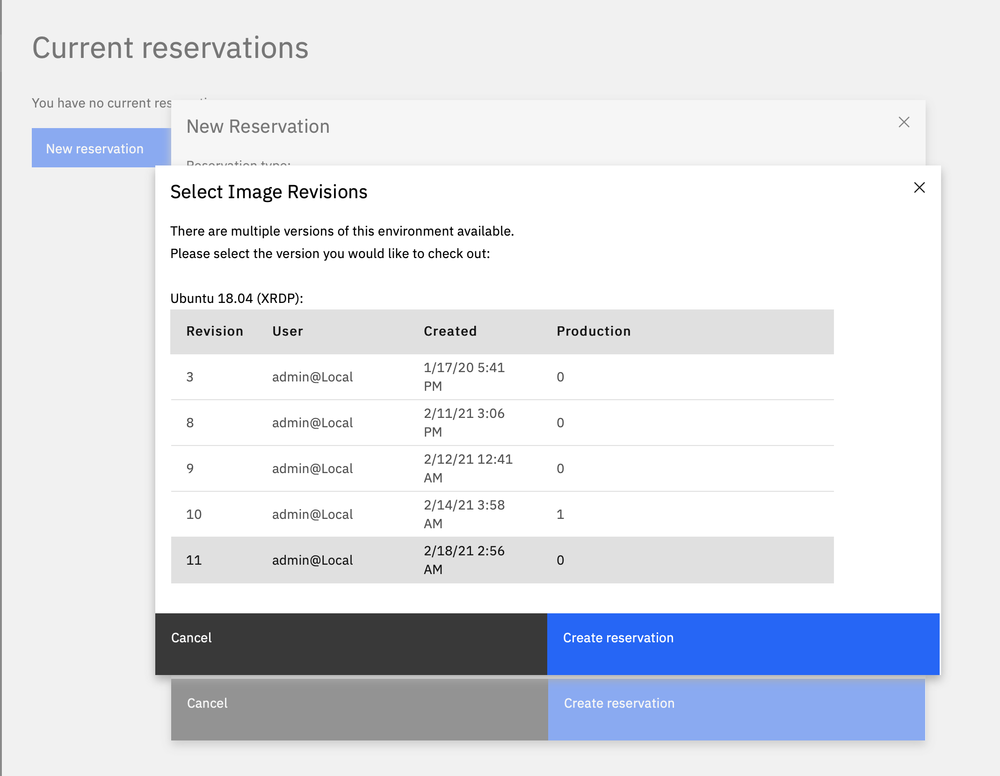
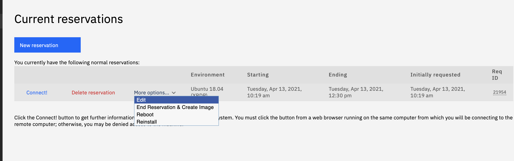
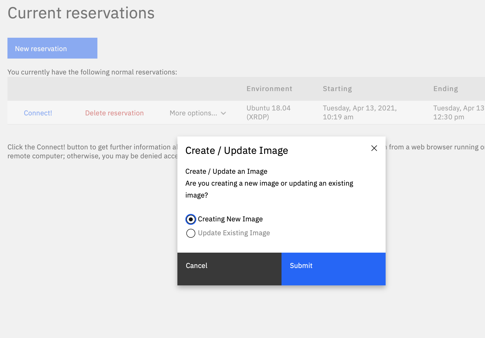
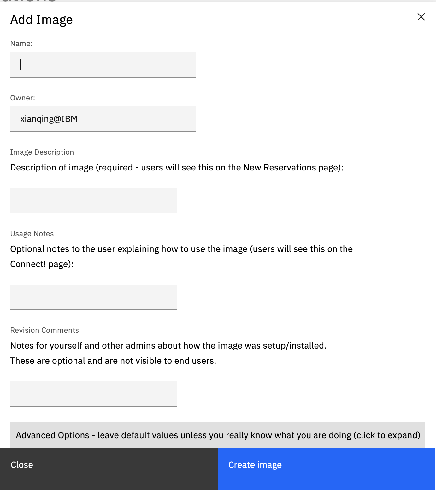
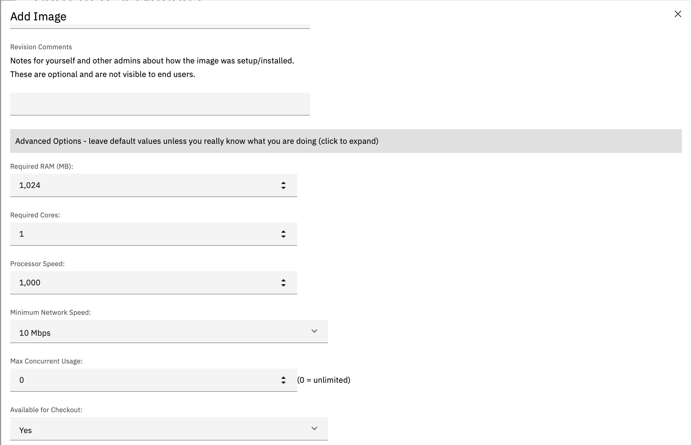

---

copyright:
  years: 2021
lastupdated: "2021-03-18"

keywords: login, authentication

subcollection: cloud-for-education

---

{:shortdesc: .shortdesc}
{:external: target="_blank" .external}
{:codeblock: .codeblock}
{:pre: .pre}
{:screen: .screen}
{:tip: .tip}
{:important: .important}
{:note: .note}
{:term: .term}

# Creating and updating images
{: #creating-updating-images}

1. Reserve a target VM.

  You can reserve your target VM from “Reservations”. Basic Reservation and Imaging Reservation
  (privilege required) are both fine. The different is Imaging Reservation is using Administrator account,
  and Basic Reservation is using your account in VM) or “Manage Images”.

2. If the image has several versions, you need to select the version you would like to choose, otherwise, system will choose the version in production.

3. After login the VM and performing operations (you need to login the VM to see the button
   refreshed on website), you can click **End Reservation & Create Image** (privilege required).

   

4. You can choose **Creating new image** or **Update Existing Image** (Need to be the owner of this image.).
 
  If you create new image, the new image will be independent from the old one. You can configure image for different name, description, memory size, and etc. You can also assign the new image to different user group to use.
 
  If you update the image, the image will be considered as different version of current image. The image will have the same image name, configurations, description and etc. Usually any image can have multiple versions, but only one version can be in production. Normal users (the users do not have create image privilege) can only use the version in production, therefore admin can easily control which version common users can use.

  - If you want to create new image, you need to fill out following information, then click ***Create
    Image***, the creating process will start. Click ***Advanced Options*** if you need to change
    default configurations for the number of CPU cores, memory size, maximum concurrent usage, and etc.

  

  - If you choose to update the image, you need to fill the comment for this version, then click **Submit**.
