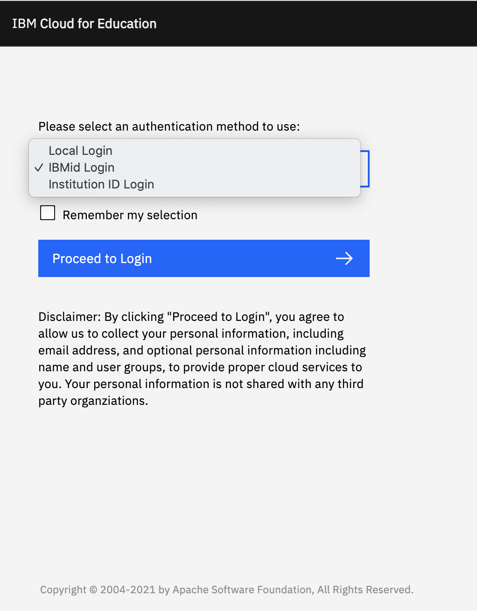
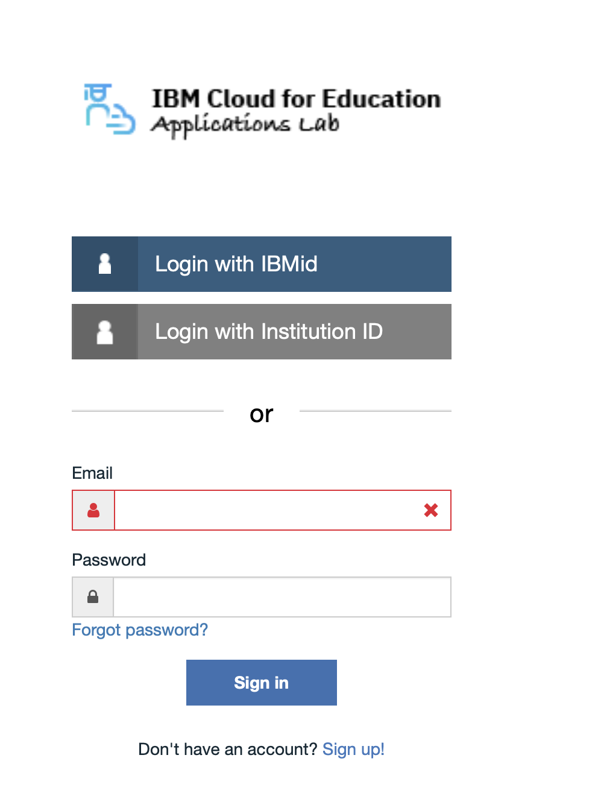

---

copyright:
  years: 2021
lastupdated: "2021-03-30"

keywords: login, authentication

subcollection: cloud-for-education

---

{:shortdesc: .shortdesc}
{:external: target="_blank" .external}
{:codeblock: .codeblock}
{:pre: .pre}
{:screen: .screen}
{:tip: .tip}
{:important: .important}
{:note: .note}
{:term: .term}

# Login to Applications Lab
{: #login}

1. Access https://app.education.cloud.ibm.com/ from your preferred browser.

1. Select **authentication method**. 
   - If you use IBM Cloud/IBM w3 account to login, choose **Login with IBMid**.
   - If you use Institution/University ID to login, choose **Login with University ID**.
   - If you use Applications Labs own ID to login, choose **Local Login**.

1. Click **Proceed to Login**.

 

1. Provide the login information according to the instruction: 
   - For IBMid, follow the instructions to input your IBMid username and password to login.
   - For University ID, choose the university/institution you belong to, and follow the instructions
     to input your username and password to login.
   - For Local login, input your username and password to login.

   

