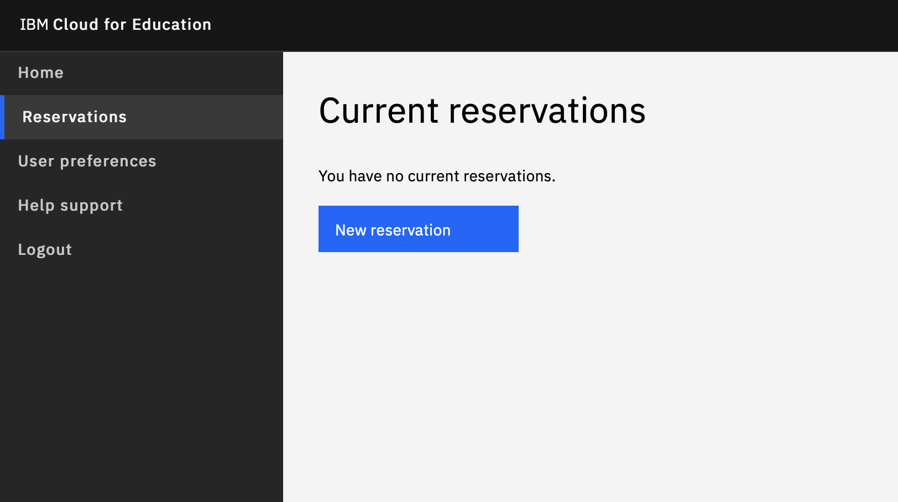
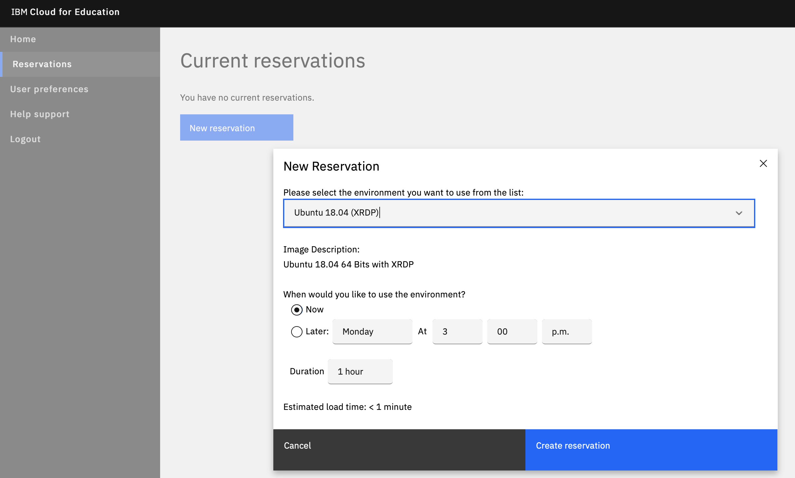
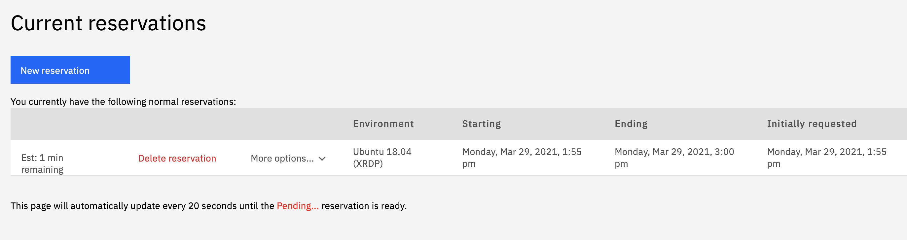
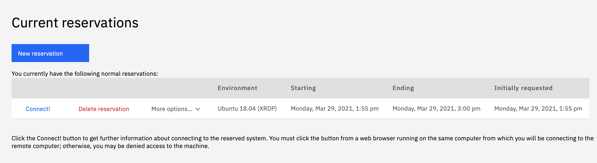
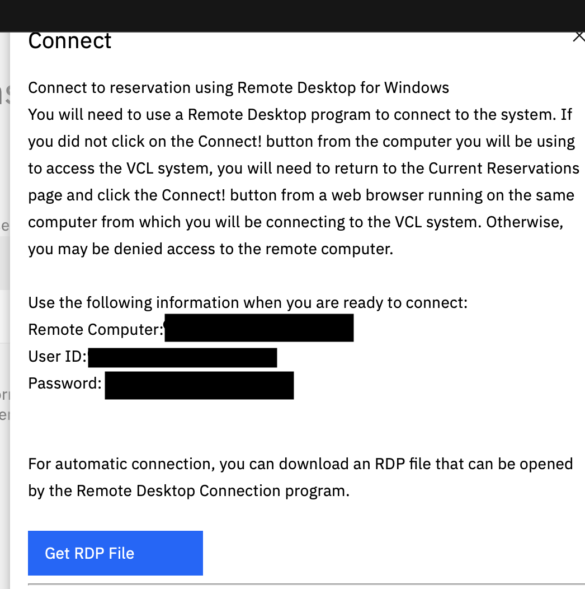

---

copyright:
  years: 2021
lastupdated: "2021-03-18"

keywords: login, authentication

subcollection: cloud-for-education

---

{:shortdesc: .shortdesc}
{:external: target="_blank" .external}
{:codeblock: .codeblock}
{:pre: .pre}
{:screen: .screen}
{:tip: .tip}
{:important: .important}
{:note: .note}
{:term: .term}

# Making Reservation
{: #make-reservation}

1. Login IBM Cloud for Education Applications Lab on https://app.education.cloud.ibm.com

2. Click "Reservations", then click "New Reservation"

3. Create Reservation 
   - Choose the environment you want to use from the list. If you are not able to access any computing environment/images, please contact support.
   - Choose when you want to start to use the environment, and duration for this reservation. If you need more duration for the reservation time than the duration given on the dropdown options, please contact support.
   - Click "Create Reservation"

4. Wait while the system provisioning the environment.

5. Click "Connect"

6. Follow the instruction to connect to the environment. The following example is to use Windows RDP to connect. 

7. When the environment is no longer needed. Click "Delete Reservation" to delete the reservation.
